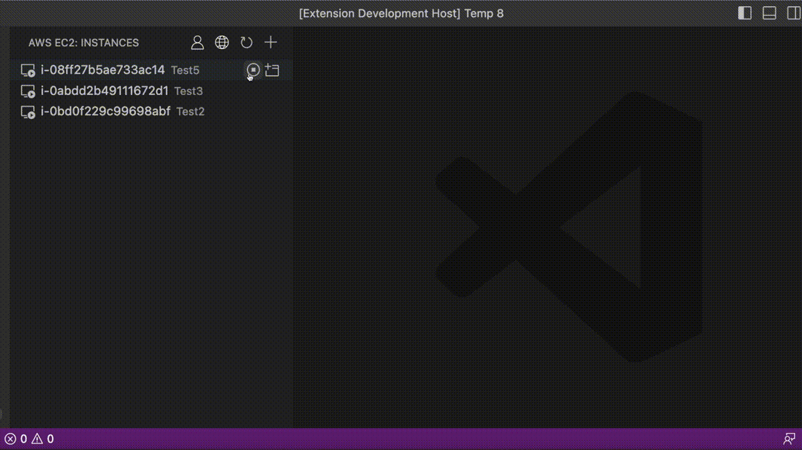
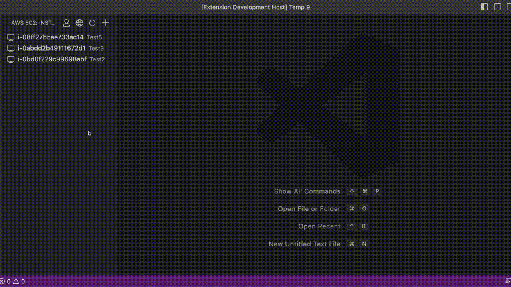

# AWS Remote Development

## Why

Launching an [AWS EC2 instance](https://docs.aws.amazon.com/AWSEC2/latest/UserGuide/EC2_GetStarted.html) and then connecting to it via the [Remote SSH plugin](https://code.visualstudio.com/docs/remote/ssh-tutorial) requires some cumbersome manual steps. Moreover, large parts of this process must be repeated for every machine you wish to connect from (i.e. generating SSH keys and authorising them on your instance).

This extension aims to make that experience quick and portable across machines that you already connect to AWS with.

## How

EC2 instances are provisioned on your behalf with [CloudFormation](https://aws.amazon.com/cloudformation/) and the connection is established via [AWS SSM](https://docs.aws.amazon.com/systems-manager/latest/userguide/ssm-agent.html) so all you have to do is set up your [AWS CLI credentials](https://docs.aws.amazon.com/cli/latest/userguide/cli-chap-configure.html) and decide what type of machine you wish to use.

## Features

The extension allows you to:

- Create remote development EC2 instances that shut down automatically when inactive
  
- Connect to your development instances via SSM
  
- Start and stop your existing EC2s
  
- Terminate your development environments when you no longer need them
  
- Select alternative AWS profiles and regions

## Getting started

1. Make sure you have your [AWS CLI credentials](https://docs.aws.amazon.com/cli/latest/userguide/cli-chap-configure.html) set up, there are various extensions that can simplify this step for you such as the offical [AWS Toolkit](https://docs.aws.amazon.com/toolkit-for-vscode/latest/userguide/connect.html)

- Your credentials need administrative rights in order to provision infrastructure, you can reduce any possibility of interfering with your existing infrastructure by using a seperate AWS account for your remote development environment
- You can add the [AdministratorAccess](https://docs.aws.amazon.com/aws-managed-policy/latest/reference/AdministratorAccess.html) managed policy to your associated IAM group or user in order to allow this extension to create and terminate your development machines

2. Make sure that your AWS Account has a [default VPC](https://docs.aws.amazon.com/vpc/latest/userguide/default-vpc.html) that your development instances can be launched in

3. (Optional) If you would like to connect to existing EC2s (not created by this extension) then you need to make sure that [Session Manager](https://docs.aws.amazon.com/systems-manager/latest/userguide/session-manager-getting-started.html) is set up for them

## Configuration

Development machines are based on Amazon Linux machine images with docker pre-installed for compatibility with a wide range of EC2 instance types. The simplest way to customise your environment is to configure a [Dev Container](https://code.visualstudio.com/docs/devcontainers/containers) for your project and launch it once you're connected to the remote machine.

### Launching with alternative machine images

If you need greater control of the base machine image (e.g. to use a [DLAMI](https://docs.aws.amazon.com/dlami/latest/devguide/what-is-dlami.html) with a GPU instance) then you can simply specify the optional image ID when launching your development environment.

### Adjusting the auto-shutdown behaviour

The development environment includes a CloudWatch alarm to shut down the instance if the CPU utilisation falls below a threshold for a certain period of time. The alarm name is set up as `${STACK_NAME}InactivityAlarm-Inactivity` and you can adjust it within the AWS console directly to suit your needs.
